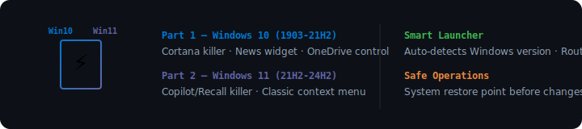

<div align="center">

# ⚡ N E X U S - O P T I M I Z E R
### *Dual-Edition Windows Optimization Suite.*

[]()
[]()
[]()
[](LICENSE)

**[📲 Download](https://github.com/earnerbaymalay/nexus11-optimizer.py/releases)** · **[🌐 Sideload Hub](https://earnerbaymalay.github.io/sideload/)**

</div>

---



## What is Nexus Optimizer?

**Modular Windows optimization toolkit with two edition-specific optimizers.** Part 1 targets Windows 10 (Cortana, News widget, OneDrive control). Part 2 targets Windows 11 (Copilot, Recall, classic context menu). Smart launcher auto-detects your Windows version and routes correctly.

---

## Quick Start

### Install

```bash
git clone https://github.com/earnerbaymalay/nexus11-optimizer.py.git
cd nexus11-optimizer.py
pip install -r requirements.txt
```

### Run

```bash
# Smart launcher (recommended) — auto-detects Windows version
python launcher.py

# Or run directly:
cd part1_win10 && python main.py    # Windows 10
cd part2_win11 && python main.py    # Windows 11
```

> ⚠️ **Must run as Administrator** (launcher auto-elevates).

---

## Features

| Feature | Win10 | Win11 |
|---------|:-----:|:-----:|
| Debloat (AppX removal) | ✅ | ✅ |
| Privacy hardening | ✅ | ✅ |
| Gaming performance | ✅ | ✅ (HAGS) |
| Network boost | ✅ | ✅ |
| Cortana / AI killer | ✅ (Cortana) | ✅ (Copilot + Recall) |
| UI tweaks | Tray icons, tablet mode | Classic context menu, taskbar align |
| Widget control | News & Interests | Widgets, Snap Layout |
| System restore point | ✅ Before changes | ✅ Before changes |

---

## Requirements

- **Python** 3.10+
- **Windows** 10 (1903-21H2) or Windows 11 (21H2-24H2, including Copilot+ PCs)
- **Administrator** privileges
- **Dependencies:** `rich`, `psutil`

---

## Related Projects

<div align="center">

| Project | Platform | Description | Link |
|---------|----------|-------------|------|
| 🌌 **Aether** | 📱 Android (Termux) | Local-first AI workstation | [Source →](https://github.com/earnerbaymalay/aether) |
| 📲 **Sideload Hub** | 🌐 Web / PWA | Central app distribution | [Open Hub →](https://earnerbaymalay.github.io/sideload/) |

</div>

---

## Documentation

- **[🔧 Troubleshooting](TROUBLESHOOTING.md)** — Permission errors, failed tweaks, rollback steps.

---

<div align="center">

Made with ❤️ for the Windows community

[MIT License](LICENSE)

</div>
